# API de Alunos - Atividade A1

## Objetivo
Esta API foi desenvolvida com Node.js + Express para praticar os conteudos ate a Aula 4:
- organizacao da aplicacao
- rotas REST
- parametros de rota
- filtro por id
- middleware
- autenticacao basica por token
- logging com status code colorido usando `colors`

## Estrutura do Projeto

```txt
.
	index.js
	package.json
	README.md
	src/
		alunosRoutes.js
		alunos.js
		middlewares.js
	tests/
		get_img/
		post_img/
		put_img/
		delete_img/
```

## Requisitos Atendidos

1. Rotas CRUD de alunos implementadas (GET, POST, PUT, DELETE).
2. Filtro por id com parametro de rota (`/alunos/:id`).
3. Passagem de parametro por rota com uso de `req.params.id`.
4. Logging com status code colorido usando o pacote `colors`.
5. Middleware de autenticacao basica por header `x-token`.
6. Dados mantidos em memoria (array no arquivo de alunos).
7. Codigo organizado em componentes separados dentro de `src`.

## Como Executar

1. Instale as dependencias:

```bash
npm install
```

2. Rode a API:

```bash
node index.js
```

3. URL base:

```txt
http://localhost:3000
```

## Endpoints

### 1) Rota inicial

- Metodo: `GET`
- URL: `/`
- Descricao: retorna mensagem inicial da API.

Resposta esperada (200):

```json
"Bem-vindo a API de Alunos"
```

### 2) Listar alunos

- Metodo: `GET`
- URL: `/alunos`
- Descricao: retorna todos os alunos em memoria.

### 3) Buscar aluno por id (filtro por parametro)

- Metodo: `GET`
- URL: `/alunos/:id`
- Descricao: busca um aluno pelo id recebido na rota.
- Exemplo: `/alunos/2`

Uso do parametro:

```js
const idAluno = Number(req.params.id)
```

### 4) Criar aluno (protegida)

- Metodo: `POST`
- URL: `/alunos`
- Descricao: cria um novo aluno.
- Requer token no header.

Header obrigatorio:

```txt
x-token: 123456
```

Body exemplo:

```json
{
	"nome": "Maria"
}
```

### 5) Atualizar aluno por id (protegida)

- Metodo: `PUT`
- URL: `/alunos/:id`
- Descricao: atualiza o nome de um aluno existente.
- Requer token no header.

Header obrigatorio:

```txt
x-token: 123456
```

Body exemplo:

```json
{
	"nome": "Maria Atualizada"
}
```

### 6) Deletar aluno por id (protegida)

- Metodo: `DELETE`
- URL: `/alunos/:id`
- Descricao: remove aluno existente.
- Requer token no header.

Header obrigatorio:

```txt
x-token: 123456
```

## Middleware e Logging

### Middleware de autenticacao

- Local: `src/middlewares.js`
- Regra:
	- se `x-token` for diferente de `123456`, retorna `401`.
	- se token for valido, chama `next()`.

### Middleware de logging

- Local: `src/middlewares.js`
- Registra no terminal:
	- data/hora
	- metodo HTTP
	- URL
	- status code colorido

Mapa de cores do status code:

- `2xx` -> verde
- `3xx` -> ciano
- `4xx` -> amarelo
- `5xx` -> vermelho

## Evidencias de Testes (Sucesso e Erro)

### GET

Sucesso:

1. `GET /alunos` -> `200`  
	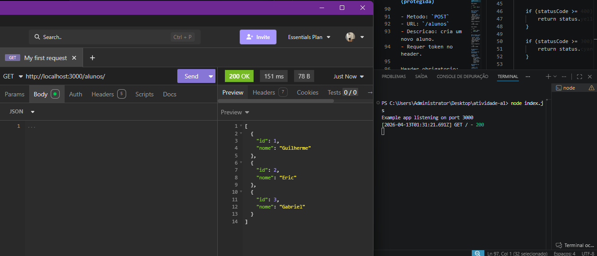
2. `GET /alunos/:id` -> `200`  
	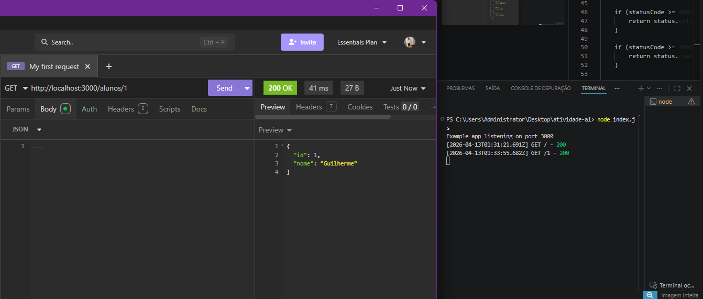

Erro:

1. `GET /alunos/:id` com id inexistente -> `404`  
	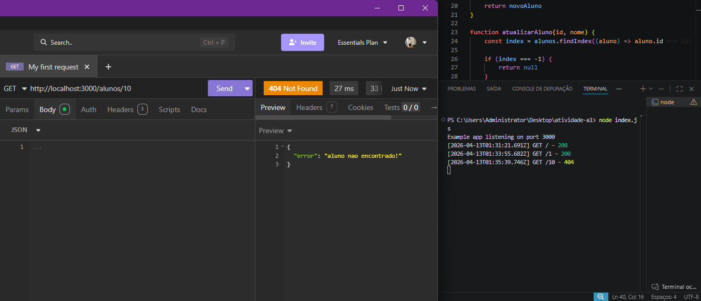

### POST

Sucesso:

1. `POST /alunos` com `x-token` valido e body valido -> `201`  
	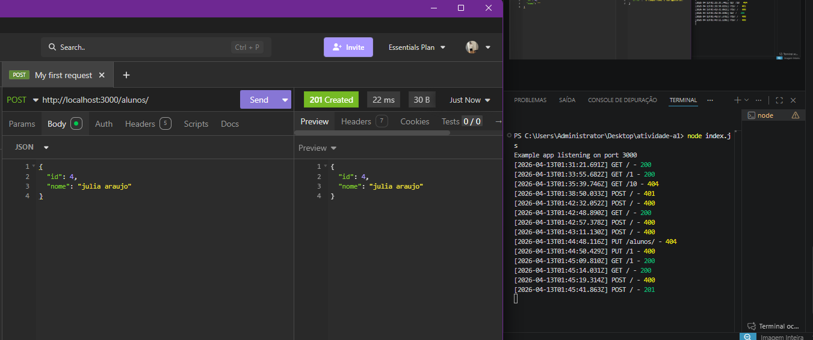
2. Validacao em lista apos criacao (GET) -> `200`  
	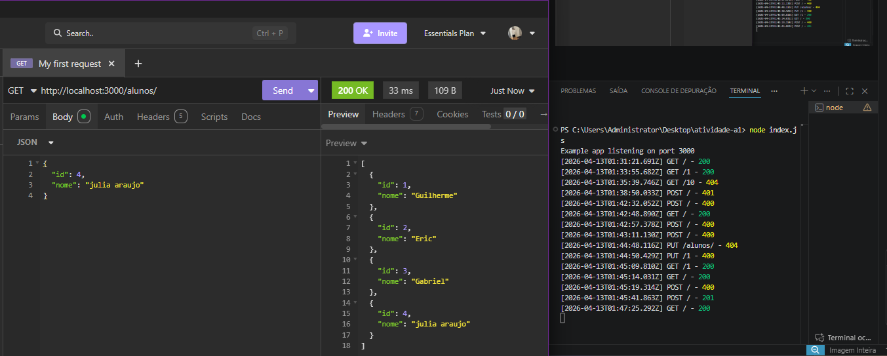

Erro:

1. `POST /alunos` sem nome -> `400`  
	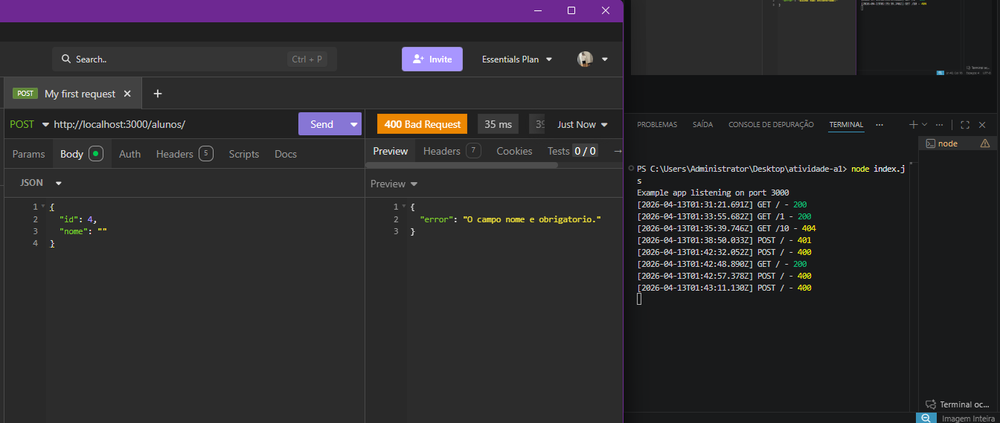
2. `POST /alunos` sem token/token invalido -> `401`  
	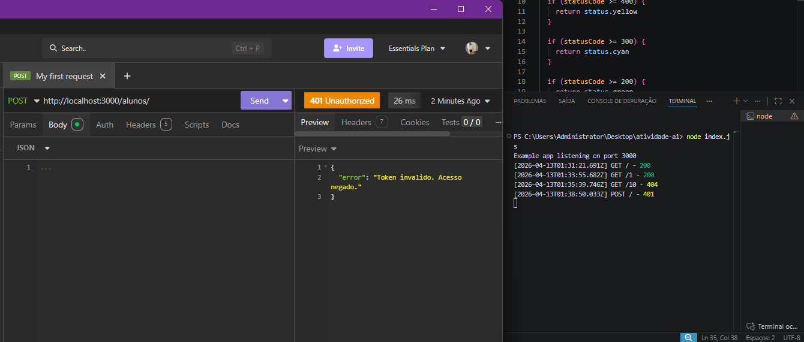

### PUT

Sucesso:

1. `PUT /alunos/:id` com token e body validos -> `200`  
	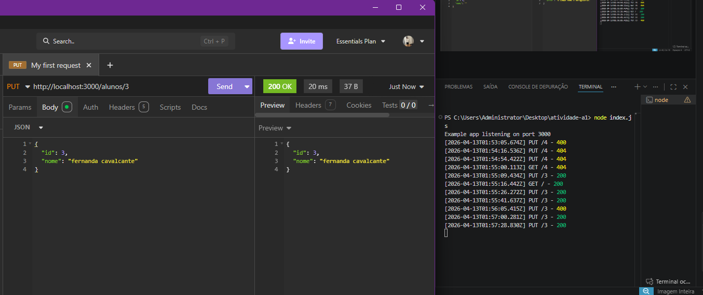

Erro:

1. `PUT /alunos/:id` sem campo nome -> `400`  
	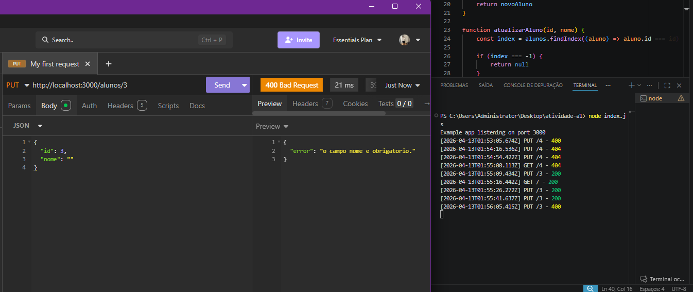
2. `PUT /alunos/:id` com id inexistente -> `404`  
	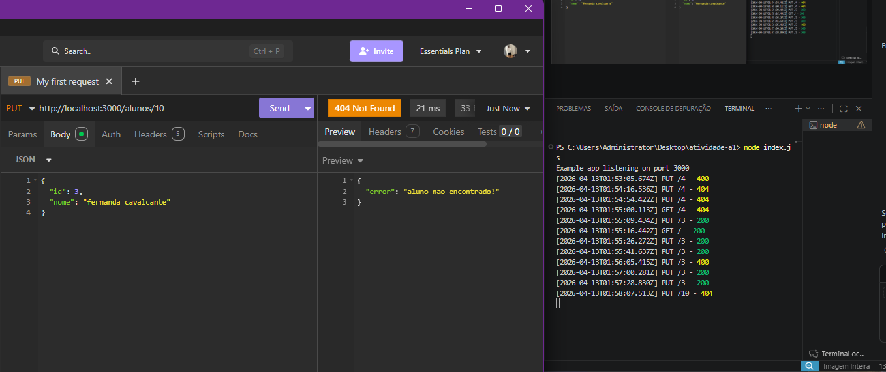

### DELETE

Sucesso:

1. `DELETE /alunos/:id` com token valido -> `200`  
	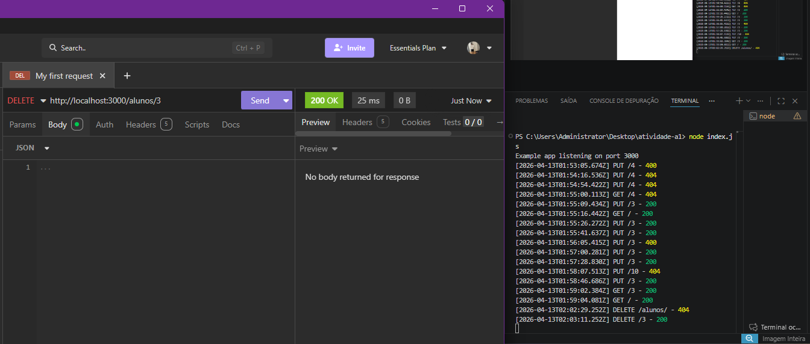
2. Confirmacao por GET apos delete -> `404`  
	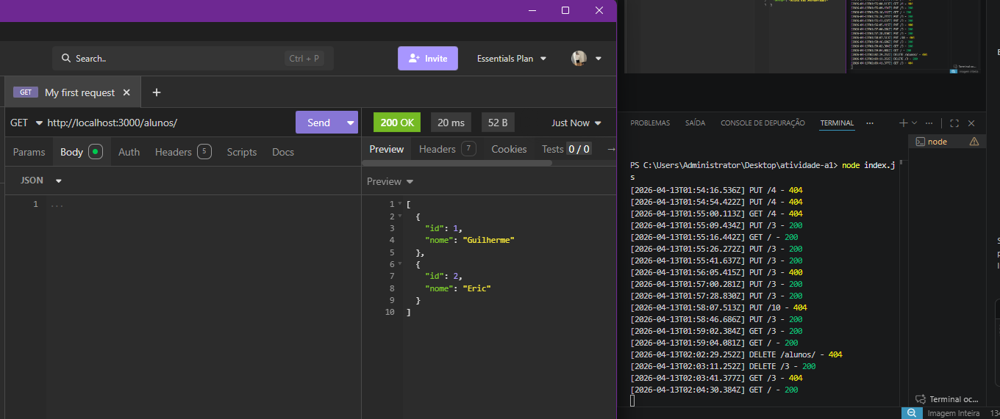

Erro:

1. `DELETE /alunos/:id` com id inexistente -> `404`  
	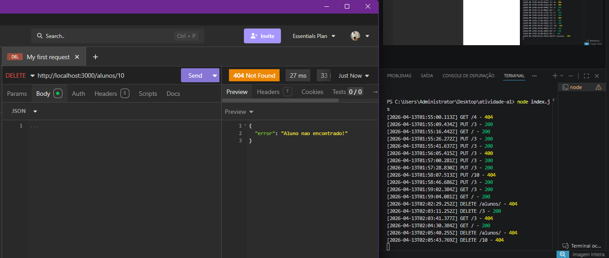
2. GET no id deletado -> `404`  
	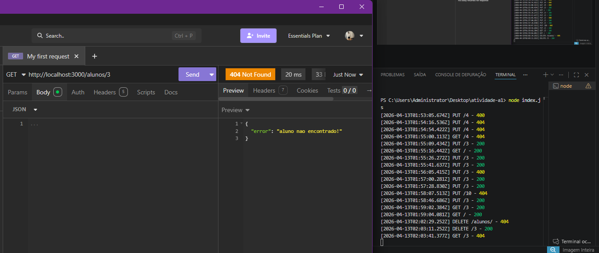

## Observacoes

1. Os dados estao em memoria, sem banco de dados.
2. Ao reiniciar a API, os dados voltam ao estado inicial do array.
3. O projeto foi organizado conforme o escopo da atividade, com separacao entre:
	 - entrada da aplicacao (`index.js`)
	 - rotas (`alunosRoutes.js`)
	 - regra de negocio/dados (`alunos.js`)
	 - middlewares (`middlewares.js`)
